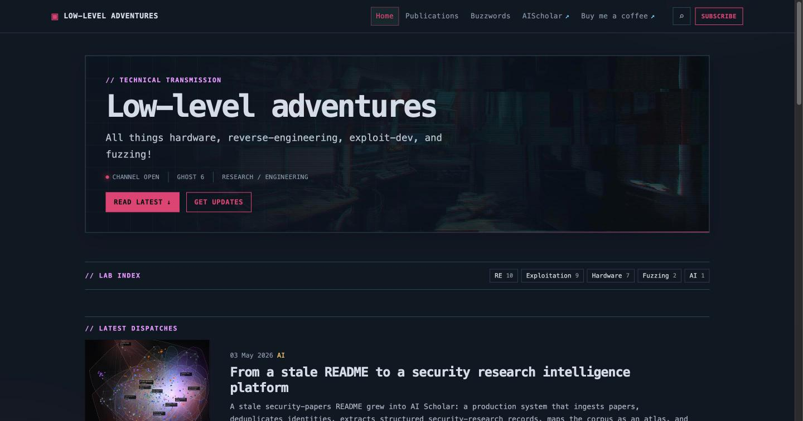

# The Shell Pro

A Ghost in the Shell-inspired theme for long-form technical writing on **Ghost 6** (≥ 6.0.0, Node ≥ 22.12). Dark terminal aesthetic, monospace type, no build step, no runtime npm dependencies — one CSS file, one JS file, Handlebars templates.



## Features

- **Reading tools** — adaptive research map (nested outline plus an artifact index only when useful), reading-progress meter, persistent text/measure/contrast controls, distraction-free focus mode, and numbered figures with keyboard-accessible zoom.
- **Code workbench** — syntax highlighting, line numbers, filenames, copy and download controls, persistent wrap/scroll preference, and compact previews for long listings. Highlight.js (pinned 11.11.1) loads only on pages that contain code; every local control and readable source remains available if the CDN does not.
- **Research workflow** — semantic post-type badges, color-coded research blocks, first-class evidence panels, copy-link/copy-citation controls, server-rendered series boxes, and a homepage lab index generated from your public tags.
- **First-class footer** — terminal colophon (`$` prompt, live *last transmission* linking the latest post, PGP fingerprint), an admin-driven navigate column, and a social icon rail with inline [Simple Icons](https://simpleicons.org/) brand marks carrying `rel="me"` (free Mastodon verification).
- **SEO** — Ghost keeps ownership of canonicals, Open Graph, and JSON-LD via `{{ghost_head}}`; the theme adds visible BreadcrumbList microdata, crawlable series/pagination links, `max-image-preview:large`, and responsive WebP hero images with LCP priority.
- **Accessible** — skip link, visible focus states, reduced-motion support, semantic navigation and dialogs.

## Install

Build the upload zip from theme files only (no preview/dev tooling):

```sh
zip -r the-shell-pro.zip package.json README.md LICENSE *.hbs partials assets/css/screen.css assets/js/shell.js
```

Upload it in **Ghost Admin → Settings → Design & branding → Change theme**, then configure title, accent color, navigation, and cover image in Ghost's own Design settings.

## Theme settings

**Ghost Admin → Settings → Design & branding → Customize.** Every setting is optional; empty values hide their feature.

| Setting | Effect |
| --- | --- |
| `show_comments` | Native Ghost comments below posts (off by default) |
| `pgp_fingerprint` | PGP fingerprint in the footer colophon, rendered verbatim |
| `pgp_key_url` | Makes the fingerprint a link (keyserver URL or a `.asc` uploaded via an editor file card) |
| `social_github` … `social_hackthebox` | Footer rail icons for GitHub, X/Twitter, Bluesky, Mastodon, LinkedIn, Discord, Hack The Box — full profile URLs |
| `social_custom_url` + `social_custom_label` | One extra platform with a generic link icon |

Re-check custom setting values after uploading a theme version that changes the settings list — Ghost may reset them.

## Content conventions

| Convention | Effect |
| --- | --- |
| First (primary) tag = public subject tag (e.g. **Exploitation**) | Drives the lab index, related posts, and tag archives |
| A tag named **Field Note**, **Deep Dive**, **Lab Log**, **Tool Release**, or **Advisory** | Sets the post-type badge (fallback: *Research note* in the article header only) |
| Internal tag `#series: Name` | Renders an ordered series box on every post sharing it |
| Internal tag `#updated` | Shows the updated date (Ghost mutates `updated_at` on trivial edits, so it is opt-in) |
| `H2`–`H5` section headings (`H1` remains the post/page title) | Populate the sticky, level-preserving table of contents |
| Two or more code blocks, figures, tables, file cards, or evidence panels | Add an Artifacts view beside the outline; zero or one artifact leaves the ordinary TOC unchanged |
| First code-block line `// file: path.ext`, `# file: path.ext`, or `; file: path.ext` | Shows the filename and enables a source download in the code toolbar |
| Code block longer than 24 source lines | Starts as a compact preview with an explicit expand control |
| Blockquote starting `> **Method:** …` | Research block; recognised labels include Environment, Hypothesis, Method, Finding, Limitation, Safety, Reproduction |
| `## Evidence & references` heading (or Sources / Further reading) | Groups that section into an evidence panel |
| Ghost pages with slug `topics` / `archives` | Auto-select the tag-directory and archive templates (archive lists the latest 100 — use `routes.yaml` collections beyond that) |

Navigation is never hard-coded: header links come from **Primary navigation**, the footer's navigate column from **Secondary navigation**.

## Development

Local Ghost 6 + MySQL preview (binds 127.0.0.1 only, fixed throwaway credentials — never deploy it):

```sh
docker compose -f docker-compose.preview.yml up -d --build --renew-anon-volumes
node scripts/seed-preview.mjs     # seeds fixture content and activates the theme
npm run check:preview             # headless-Chromium suite: ~180 assertions on UI + SEO contracts
```

Repeat the `up --build` and seed steps after editing theme files (the preview bakes the theme into its image). `npm exec --yes --package=gscan -- gscan .` runs Ghost's compatibility scanner. Release zips and `.scratch/` notes are intentionally untracked.

## License

GPL-3.0 — see [LICENSE](LICENSE). Rebuilt for Ghost 6 from the original [the-shell-pro](https://github.com/Neulana/the-shell-pro) by Neulana. Brand icons from the CC0 [Simple Icons](https://simpleicons.org/) set.
